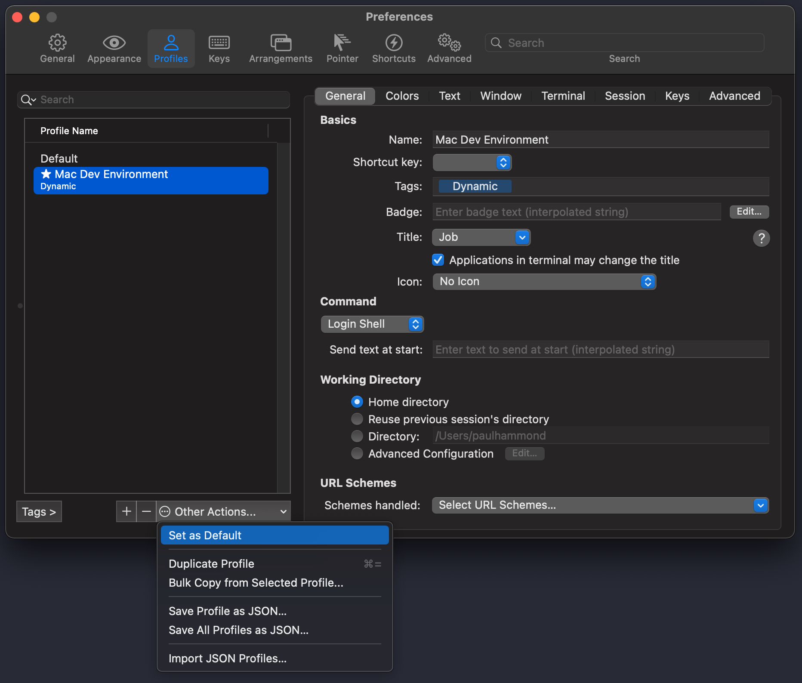
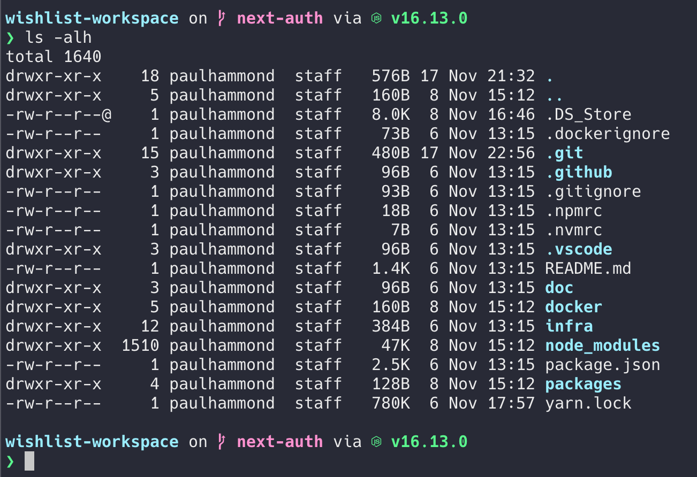
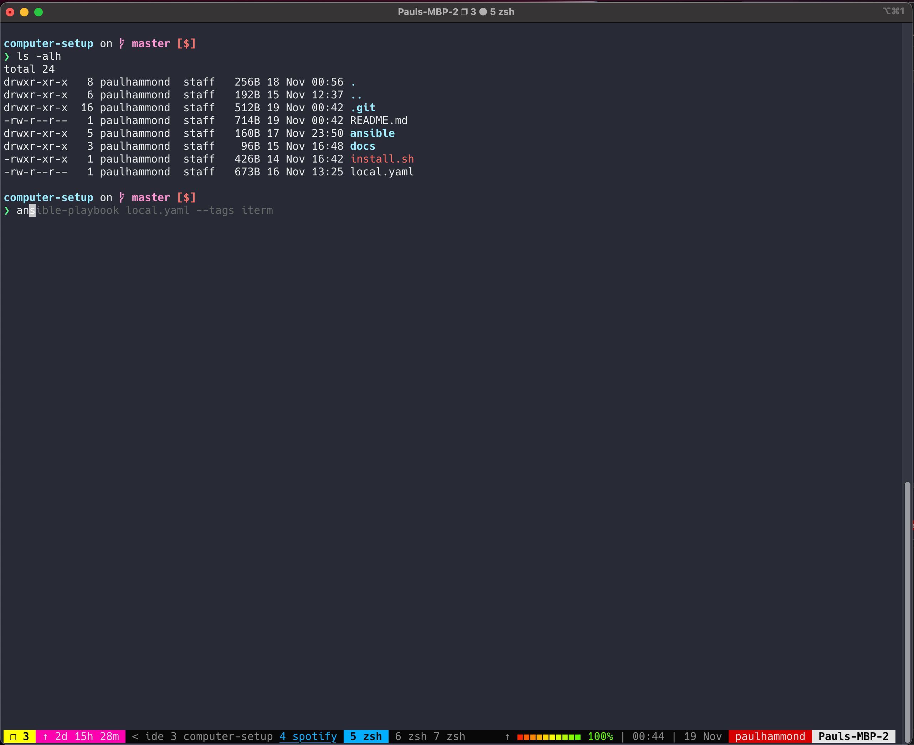

# Mac Dev Machine Setup

This repo will automatically setup a new mac so I don't have to go through the faff of installing and configuring everything each time I need to setup a new computer.

To run, it should just be a case of running `./install.sh`

## To setup the iterm theme

To setup the iterm theme, you will need to go to iterm -> Preferences and select "Profiles". The "Mac Dev Environment" profile should be there. Select, click "Other Actions" and click "Set as Default":

Look how lovely it looks:

And here is how Tmux looks:

## Understanding how GPG keys in Git work

[Refer to these docs](https://samuelsson.dev/sign-git-commits-on-github-with-gpg-in-macos/)

After running the `install.sh` script, you will need to manually run:

`gpgconf --kill gpg-agent`

And then do a commit. This will store the gpg key in the keychain so you don't have to keep adding the password every time.

## To setup personal .ssh key:

Run `./install-personal-ssh-key.sh`.