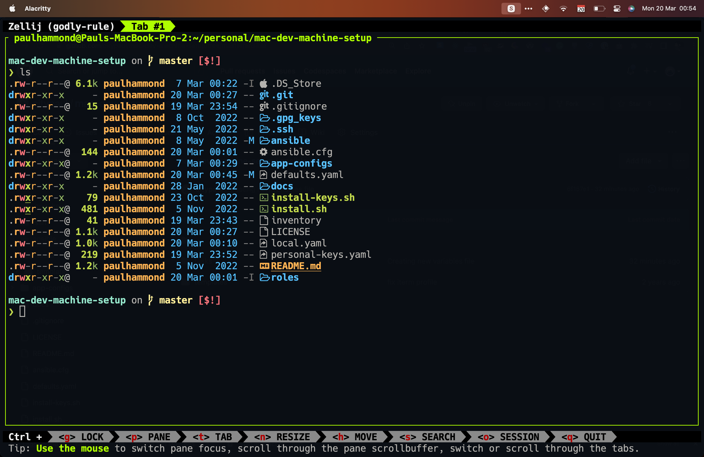

# Mac Dev Machine Setup

This repository contains Ansible playbooks and scripts to automatically set up a new Mac for development. It installs and configures various tools and applications, saving time and effort when setting up a new machine.

## Prerequisites

- A Mac running macOS (tested on macOS 15.0 arm64)
- Internet connection

## Installation

1. Clone this repository:

   ```sh
   git clone https://github.com/your-username/mac-dev-setup.git
   cd mac-dev-setup
   ```

2. Run the new-mac setup script:

   ```sh
   ./new-mac.sh
   ```

   This will:

   - Install Xcode Command Line Tools
   - Install Homebrew
   - Install Git

3. Run the setup tasks:

   ```sh
   make setup
   ```

   This will:

   - Install or update Homebrew, Python, and Ansible
   - Set up the necessary directories and environment variables

4. Choose the appropriate installation target:

   - For personal setup: `make install-personal`
   - For work setup: `make install-work`

5. To install private keys (optional):

   ```sh
   ./install-keys.sh
   ```

   This script uses Ansible Vault to decrypt and install private keys.

## Configuration

- The `defaults.yaml` file contains default settings and package lists.
- The `local.yaml` file is the main Ansible playbook that imports various tasks.
- The `vars/api_keys.yml` file contains encrypted API keys. For more information, see [API Keys Documentation](./docs/api-keys.md).

## Post-Installation Steps

1. Set up the iTerm2 theme:

   - Open iTerm2 -> Preferences -> Profiles
   - Select "Mac Dev Environment" profile
   - Click "Other Actions" and select "Set as Default"

   

2. Set up GPG for Git:
   After running the installation script, manually run:
   ```sh
   gpgconf --kill gpg-agent
   ```
   Then make a Git commit. This will store the GPG key in the keychain.

## Screenshots

### Alacritty Terminal with Zellij



### iTerm2 Theme


### Tmux Theme


## Troubleshooting

- If you encounter issues with Python or pip, try the following steps:

  1. Ensure you have the latest version of Homebrew:

     ```sh
     brew update && brew upgrade
     ```

  2. Reinstall Python using Homebrew:

     ```sh
     brew reinstall python
     ```

  3. Restart your terminal or source your `.zshrc`:

     ```sh
     source ~/.zshrc
     ```

- If Homebrew is installed but not recognized, restart your terminal and run the script again.
- If certain tools are not recognized after installation, try sourcing your `.zshrc` file:

  ```sh
  source ~/.zshrc
  ```

- In some cases, you may need to run the installation script multiple times to ensure all components are properly installed and configured.
- If you encounter permission issues, ensure you have the necessary rights to install software on your system.

## Additional Resources

- [Understanding GPG keys in Git](https://samuelsson.dev/sign-git-commits-on-github-with-gpg-in-macos/)
- [Dotfiles Repository](https://github.com/citypaul/.dotfiles)

## Contributing

This is a personal project for my own setup, but if you find any issues or have suggestions, please feel free to open an issue or submit a pull request.

## License

[Include your license information here]
